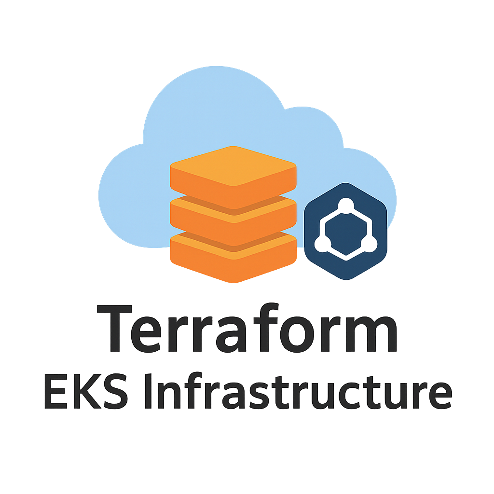

# 🌐 Terraform EKS Infrastructure

  
*A scalable cloud infrastructure project with Terraform, AWS EKS, and RDS.*

[![Contributors][contributors-shield]][contributors-url]  
[![Forks][forks-shield]][forks-url]  
[![Stargazers][stars-shield]][stars-url]  
[![Issues][issues-shield]][issues-url]  
[![License][license-shield]][license-url]  

---

##  Table of Contents
- [About the Project](#about-the-project)  
- [Built With](#built-with)  
- [Getting Started](#getting-started)  
- [Usage](#usage)  
- [Roadmap](#roadmap)  
- [Contributing](#contributing)  
- [License](#license)  
- [Contact](#contact)  

---

##  About the Project
This project provisions cloud infrastructure with **Terraform on AWS**, featuring:  
- **Amazon EKS** for Kubernetes workloads  
- **Amazon RDS** for relational database management  

It provides a scalable, automated setup for deploying containerized applications with persistent data storage, following **Infrastructure-as-Code (IaC) best practices**.  

---

## 🛠 Built With
* [![Terraform][Terraform]][Terraform-url]
* [![AWS][AWS]][AWS-url]
* [![Kubernetes][Kubernetes]][Kubernetes-url]
* [![Docker][Docker]][Docker-url]
---

##  Getting Started

### Requirements
- [Terraform](https://developer.hashicorp.com/terraform/downloads) installed  
- [AWS CLI](https://aws.amazon.com/cli/) configured  
- An AWS account with permissions to create EKS, RDS, and networking resources  

### Installation

1. **Clone this repository:**
```bash
https://github.com/Zergi0/terraform_eks.git
```
2.**Navigate to repository:**
```bash
cd terraform_eks
```

3. **Set-Up Enviroment variables:**
```bash
./set-up/set-up-script.sh
```
4. **Run Terraform:**
```bash
terraform init
```
```bash
terraform apply
```
when prompted write yes

---

## 📬 Contact
**Contributor:**  
<a href="https://github.com/Zergi0">Zergi0</a>  

Project Link: [https://github.com/Zergi0/terraform_eks](https://github.com/Zergi0/terraform_eks)  

---


## Acknowledgments
- [Terraform AWS Provider](https://registry.terraform.io/providers/hashicorp/aws/latest)  
- [EKS Documentation](https://docs.aws.amazon.com/eks)  


<!-- MARKDOWN LINKS & IMAGES -->
[Terraform]: https://img.shields.io/badge/Terraform-844FBA?style=for-the-badge&logo=terraform&logoColor=white
[Terraform-url]: https://www.terraform.io/
[AWS]: https://img.shields.io/badge/AWS-232F3E?style=for-the-badge&logo=amazonaws&logoColor=white
[AWS-url]: https://aws.amazon.com/
[Kubernetes]: https://img.shields.io/badge/Kubernetes-326CE5?style=for-the-badge&logo=kubernetes&logoColor=white
[Kubernetes-url]: https://kubernetes.io/
[Docker]: https://img.shields.io/badge/Docker-2496ED?style=for-the-badge&logo=docker&logoColor=white
[Docker-url]: https://www.docker.com/
[contributors-shield]: https://img.shields.io/github/contributors/Zergi0/terraform_eks.svg?style=for-the-badge
[contributors-url]: https://github.com/Zergi0/terraform_eks/graphs/contributors
[forks-shield]: https://img.shields.io/github/forks/Zergi0/terraform_eks.svg?style=for-the-badge
[forks-url]: https://github.com/Zergi0/terraform_eks/network/members
[stars-shield]: https://img.shields.io/github/stars/Zergi0/terraform_eks.svg?style=for-the-badge
[stars-url]: https://github.com/Zergi0/terraform_eks/stargazers
[issues-shield]: https://img.shields.io/github/issues/Zergi0/terraform_eks.svg?style=for-the-badge
[issues-url]: https://github.com/Zergi0/terraform_eks/issues
[license-shield]: https://img.shields.io/github/license/Zergi0/terraform_eks.svg?style=for-the-badge
[license-url]: https://github.com/Zergi0/terraform_eks/blob/main/LICENSE
